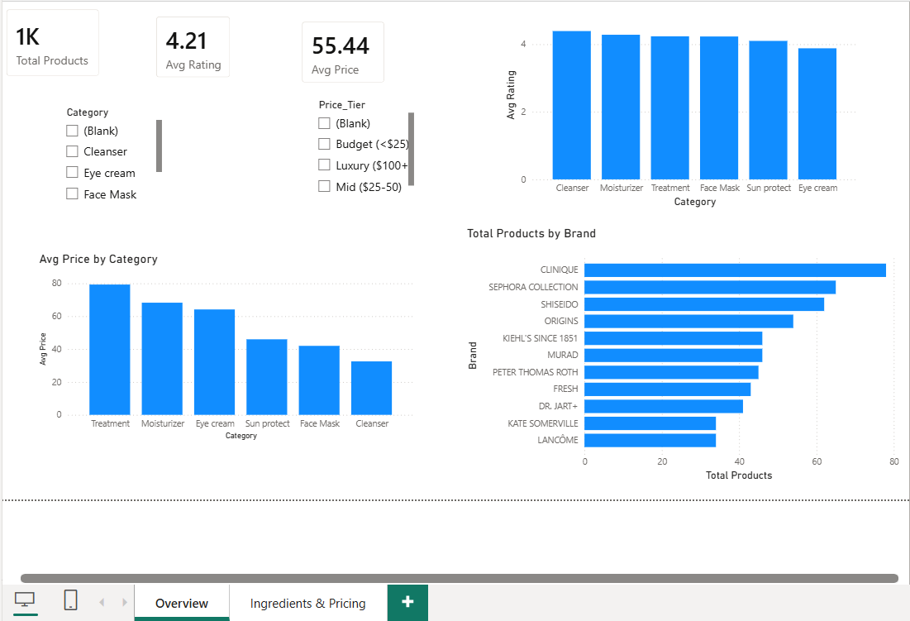
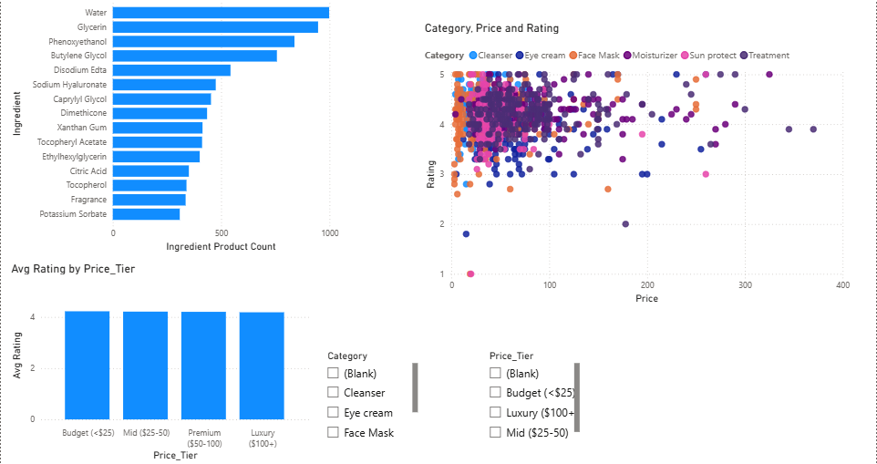

# Skincare & Cosmetics Market Analytics

A data analytics project answering one question using a 1,472-product Sephora catalog: **does price actually predict product quality?**

End-to-end pipeline: raw data → Python cleaning → SQL analysis → Python visualizations → Power BI dashboard.

**Tools:** Python (pandas) · SQLite/SQL · Matplotlib/Seaborn · Power BI

---

## Key findings

1. **Price barely moves rating.** Average rating stays in a tight 4.0–4.2 band from budget (under $25) to luxury ($100+) products, despite an 11x price difference.
2. **Eye cream underperforms.** It's priced mid-pack but rated lowest of all six categories — worth flagging for further investigation.
3. **Formula complexity doesn't buy a better rating.** Products with 50+ ingredients rate about the same as products with under 15.
4. **Data quality catch:** several products had `Rating = 0`, which turned out to mean "not yet rated" rather than a real zero-star score. These were identified and excluded from all rating-based analysis to avoid skewing category and brand averages.

---

## Dataset

1,472 Sephora skincare products across 6 categories and 116 brands, with brand, price, rating, full ingredient list, and skin-type suitability.

---

## Project structure

| File | Purpose |
|---|---|
| `cosmetics_raw.csv` | Raw source data |
| `cosmetics_clean.csv` | Cleaned data (output of step 1) |
| `ingredients_long.csv` | One row per product-ingredient pair (output of step 1) |
| `skincare.db` | SQLite database (output of step 2) |
| `01_clean_data.py` | Cleaning + data quality checks |
| `02_load_sql.py` | Loads cleaned data into SQLite |
| `03_run_queries.py` | Runs SQL analysis, prints insights |
| `04_visualize.py` | Generates charts |
| `queries.sql` | Reference SQL (window functions, CTEs) |
| `charts/` | PNG chart outputs |
| `skincare-market-analysis.pbix` | Power BI dashboard |

---

## How to run

Install dependencies:

```bash
pip install pandas matplotlib seaborn
```

Run the pipeline in order:

```bash
python 01_clean_data.py
python 02_load_sql.py
python 03_run_queries.py
python 04_visualize.py
```

Then open `skincare-market-analysis.pbix` in Power BI Desktop for the interactive dashboard.

---

## SQL techniques used

See `queries.sql` for the full set. Includes:

- Window functions — `RANK()`, `DENSE_RANK()` partitioned by category
- CTEs for multi-step logic
- `GROUP BY` / `HAVING` with derived metrics

---

## Dashboard

Built in Power BI — two pages, with category, brand, and price-tier breakdowns, a price-vs-rating scatter plot, and interactive slicers.

**Overview**


**Ingredients & Pricing**

